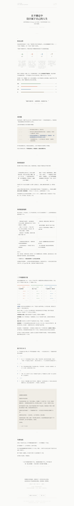

# Life Designer

> **不是帮你「想清楚」，是陪你「走出来」。**

你有没有过这种感觉——每天很忙，但不知道在忙什么？能力不差，但看不到五年后的自己？知道该改变，但不知道往哪走？

这个 Skill 就是为这种时刻准备的。

它把斯坦福连续 11 年最受欢迎的课——Life Design Lab——变成了一个 AI 人生设计教练。你不用出门，不用约时间，跟它聊 20-60 分钟，它会陪你走完四个阶段，最后给你一份 8000-12000 字的《个人人生设计蓝图》。

**不是诊断书，不是鸡汤，是一封真正懂你的朋友写给你的长信。**

---

## 它会跟你聊什么

```
你在这里     →   给健康/工作/娱乐/爱打分，找到真正失衡的地方
你的指南针   →   你的工作观和人生观在指向同一个方向吗？
寻路         →   那些让你忘记时间的时刻，藏着你的答案
多种可能     →   设计三个完全不同的五年人生版本——三个都是 A 计划
                ↓
           一份 HTML 蓝图（双击就能打开，暖色调，很好看）
```

聊完之后你会能回答三个问题：
- **我的真问题是什么？**（不是你一开始以为的那个）
- **我有哪三条路可以走？**
- **明天就能做什么？**

---

## 为什么做这个

网上有很多「人生设计 Prompt」。大部分的问题是一样的——**AI 说话太像 AI 了。**

> 「我理解你的感受。根据分析，你的核心问题是自我实现需求与当前工作价值观之间的不匹配。建议你在日常工作中增加心流体验的比重。」

谁跟朋友这样说话？

这个 Skill 花了大量精力解决一件事：**让 AI 像真人朋友一样跟你聊天。** 温暖、松弛、偶尔一针见血。

我们写了 50+ 条「永远不要这样说」的表达规则：

| AI 的通病 | 它会说的 |
|-----------|---------|
| 心理咨询师的客套 | ~~「我理解你的感受」~~ → 「这句话我记住了」 |
| 分析报告的结构化 | ~~「根据分析，你的核心问题是...」~~ → 「我觉得真正卡住你的可能不是你以为的那件事」 |
| 空洞的鼓励 | ~~「加油你可以的！」~~ → 「你已经有方向了——只是还没允许自己看见」 |

每个对话阶段都有好/坏回应的逐字对比，详见 [SKILL.md](./SKILL.md)。

---

## 30 秒开始

```bash
# 1. 克隆
git clone https://github.com/Jackychen-12/life-designer.git

# 2. 安装到 Claude Code
cp -r life-designer ~/.qoderwork/skills/life-designer

# 3. 在 Claude Code 里说：
#    「我迷茫了」
#    「不知道做什么」
#    「帮我设计人生」
#    ……任何触发词都行
```

**触发词：** 人生设计 / 人生规划 / 我迷茫了 / 不知道做什么 / 职业方向 / 设计我的人生 / 帮我梳理人生 / life design / 帮我想想未来 / 我卡住了 / 不知道该怎么选

---

## 预览

<p align="center">
  <a href="https://jackychen-12.github.io/life-designer/">
    
  </a>
</p>

👉 **[点击查看完整在线 Demo](https://jackychen-12.github.io/life-designer/)**

或者本地预览：

```bash
python3 scripts/report_generator.py --demo
open output/demo-report.html
```

---

## 你会得到什么

对话结束后，AI 会生成一份精美的 HTML 报告。双击打开，包含：

```
┌──────────────────────────────────────────────┐
│  LIFE DESIGN BLUEPRINT                       │
│  个人人生设计蓝图                             │
│                                              │
│  01  你在这里                                │
│      健康 7/10  工作 5/10  娱乐 3/10  爱 7/10 │
│      + 四段彩色进度条（自动生成）             │
│                                              │
│  ✦  对话金句卡                               │
│     「我像个跑步机——跑得很快但原地不动」      │
│                                              │
│  02  真问题                                  │
│      你以为的 → 重力问题 → 真问题 → 错误前提  │
│                                              │
│  03  你的指南针                               │
│      工作观 ←——→ 人生观                      │
│                                              │
│  04  你的能量地图                             │
│      心流时刻 / 回血活动 / 擅长但耗能 / 偏向   │
│                                              │
│  05  三个奥德赛计划                           │
│      A 延续当下  B 另一条路  C 无限可能       │
│                                              │
│  06  原型行动清单                             │
│      谈 / 试 / 走 / 醒                       │
│                                              │
│  ✉  给 6 个月后自己的一封信                   │
│                                              │
│  07  失败免疫                                │
│      「你有三个版本可以试。走不通就换。」      │
│      + 哲学引言                              │
└──────────────────────────────────────────────┘
```

暖色调、Serif 字体、极简留白。三个惊喜元素：对话金句卡、四段彩色进度条、给未来的信。

---

## 灵感来源

来自公众号「数字生命卡兹克」的文章《我把斯坦福最火的一门课，做成了Prompt来帮我设计人生》。我们在那篇文章的基础上做了这些：

- 融入 6 大理论体系，涵盖 20+ 本参考书
- 写了完整的四阶段对话流程 + 每阶段的好/坏对话示范
- 加了 50+ 条语言禁用规则，解决 AI 说话太机器的问题
- 做了情感共鸣引擎——让对话真的打到心里
- 写了报告生成脚本和对话追踪脚本
- 输出精美的 HTML 蓝图

---

## 项目结构

```
life-designer/
├── SKILL.md                        # 核心文件：Skill 定义（1000+ 行）
├── README.md                       # 你正在看的这个
├── LICENSE                         # MIT
├── scripts/
│   ├── report_generator.py         # 报告生成器：富文本 JSON → 精美 HTML + Markdown
│   ├── markdown_generator.py       # Markdown 报告生成器
│   └── dialogue_tracker.py         # 对话阶段追踪器
├── references/
│   └── talk_examples.md            # 完整对话示范（从头到尾）
└── output/
    ├── demo-report.html            # 运行 --demo 生成的示例报告
    └── demo-report.md              # Markdown 版本
```

---

## 脚本工具

### 报告生成器（v2）

对话结束后，AI 把对话内容整理为富文本 JSON，脚本自动渲染成精美 HTML 和 Markdown 双版本：

```bash
# 从 JSON 生成 HTML + Markdown 报告
python3 scripts/report_generator.py --input conversation.json

# 单独生成 Markdown 版本
python3 scripts/markdown_generator.py --input conversation.json

# 生成示范报告（看看效果）
python3 scripts/report_generator.py --demo
```

**核心架构：**「AI 写富文本，脚本做排版」。每个章节都有一个 `narrative` 字段——AI 在这里自由写作深度叙事，不被格子限制。HTML 版本带交互效果（奥德赛计划点击展开），Markdown 版本可直接导入 Obsidian / Logseq / VS Code。

惊喜元素：
- **对话金句卡** — 从对话中选出最有力的一句话，渲染成精美卡片
- **四段彩色进度条** — 根据四维度分数自动生成可视化（健康/工作/娱乐/爱）
- **给未来的信** — 用用户视角写给 6 个月后的自己

### 对话追踪器

确保对话走完四阶段十步骤，不跳步不遗漏：

```bash
python3 scripts/dialogue_tracker.py --action init
python3 scripts/dialogue_tracker.py --action next
python3 scripts/dialogue_tracker.py --action complete --json '{"step":"1.1"}'
python3 scripts/dialogue_tracker.py --action status
```

---

## 理论基础

| 理论 | 核心书目 | 作者 |
|-----|---------|------|
| 设计思维 | *Designing Your Life* | Bill Burnett & Dave Evans |
| 心流 | *Flow* | Mihaly Csikszentmihalyi |
| 积极心理学 | *Flourish* | Martin Seligman |
| 黄金圈 / 无限游戏 | *Start with Why* / *The Infinite Game* | Simon Sinek |
| 成长型思维 | *Mindset* | Carol Dweck |
| 意义感 | *Man's Search for Meaning* | Viktor Frankl |

完整 20+ 本参考书目和 13 个实践工具框架，见 [SKILL.md](./SKILL.md) 第九章。

---

## 六条信念

1. 人生是设计问题，没有唯一正解
2. 重新定义问题——你卡住可能是在回答错误的问题
3. 接受重力问题——改变不了的现实不是问题，是现实
4. 先逼出足够多可能性再挑
5. 激情是好设计带来的副产品，不是前提
6. 人生是无限游戏，没有输赢

---

## 想参与？

欢迎 PR 和 Issue。可以做的事：

- 改善对话追问技巧（SKILL.md 里的对话示范）
- 补充新的理论参考和书目
- 优化 HTML 报告模板的视觉效果
- 增加多语言支持
- 把对话示范做得更丰富

---

## 致谢

- **Bill Burnett & Dave Evans** — 斯坦福 Life Design Lab 创始人
- **数字生命卡兹克** — 原始灵感来源
- **Stanford d.school** — 设计思维的发源地

## License

MIT — 随便用。详见 [LICENSE](./LICENSE)
